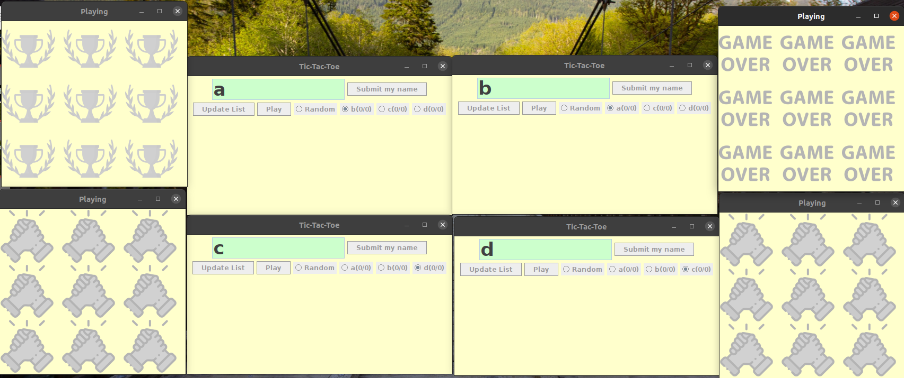
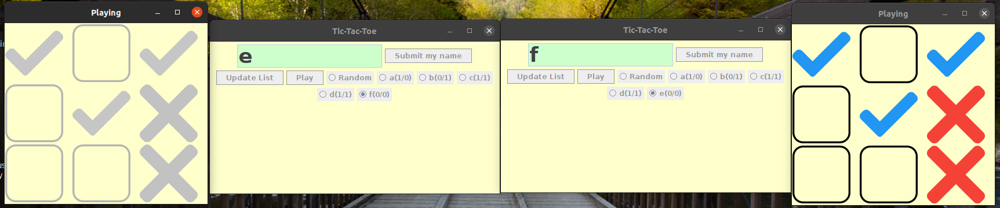

# Online Tic-Tac-Toe

## Run
```
javac Client.java
javac PlayGround.java
java Client
```
```
javac Server.java
java Server
```

## Function
```
- Able to let multiple users to play.
- Can show a player frequency of win and lose. (win/lose)
- Give player a random opponent.
```

## Idea
- Server
    - use a thread to handle connection
    - a thread will loop until win, lose or draw
- Client
    - Lauch.java build the waiting room for players
    - PlayGround.java build place to play (9 square)

## Demo
- 
- 